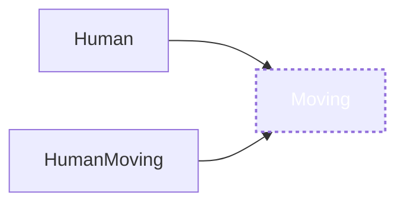
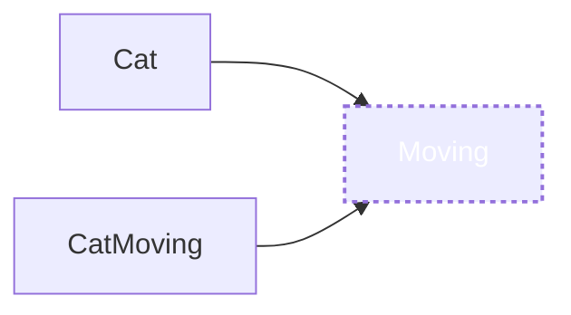

의존성, 의존성 주입, 의존성 역전에 대해서 정리하려고 합니다.

## 의존성

아래와 같은 코드가 있을 때,

`A클래스는 B클래스에 의존성을 갖는다`라고 합니다.

```swift
class A {
    let b = B() // 'A클래스는 B클래스에 의존성을 갖는다'
}

class B {

}
```

이때 객체 인스턴스를 사용하는 곳(A)을 `클라이언트(Client)`라고 부르고,

`의존성(a dependency)`은 사용되는 객체 인스턴스(B)를 말합니다.

`의존성이 변하면, 클라이언트에 영향을 미치게 되는 관계`입니다.

## 의존성 주입(Dependency Injection, DI)

위 코드는 의존성을 클라이언트가 직접 인스턴스를 만들고 있습니다.

아래와 같이 `의존성의 인스턴스를 외부로부터 생성하여 전달받는 것`을 `의존성 주입`라고 부릅니다.

```swift
class A {
    let b: B

    init(b: B) {
        self.b = b
    }
}
```

위와 같은 형태는 아래와 같은 `의존성 방향`을 가지게 됩니다.


좀 더 구체적인 예시를 들어보겠습니다.

```swift
class Moving {
    func walking() {
        print("🚶🏻👣👣👣👣")
    }

    func running() {
        print("🏃🏻‍♂️💨💨💨💨")
    }
}

class Human {
    let moving: Moving

    init(move: Moving) {
        self.moving = move
    }

    func walking() {
        moving.walking()
    }

    func running() {
        moving.running()
    }
}
```

위 코드는 `Human`클래스가 `Moving`클래스에 의존성을 가지고 있습니다.


만약 이 상태에서 `Moving`을 `Human`이 아닌 다른 동물에도 적용을 하고 싶다면 어떻게 해야 할까요?

혹은 다른 방법으로 걷거나 달리는 `Human`을 원하게 되면?

`Moving`에 다른 메서드를 추가하거나? 다른 `Moving`을 만들어야 할까요? 그러고 나면 `Human`도 그에 맞춰 수정해야겠죠?

위와 같은 의존관계에서는 유연하게 변화를 주기가 어렵습니다. 변화에 취약합니다.

## 의존성 역전의 원칙(Dependency Inversion Principle, DIP)

`SOLID` 원칙 중에 마지막 `D`에 해당하는 `의존성 역전의 원칙`이 있습니다.

이는 `추상화된 것은 구체적인 것에 의존하면 안 되고, 구체적인 것이 추상화된 것에 의존해야 한다.`라는 원칙입니다.

위 예시가 변화에 취약했던 이유는 `구체적인 것에 의존했기 때문`입니다.

그렇다면 어떻게 코드를 개선할 수 있을까요?

`Swift`에서는 `Protocol`을 통해서 추상화된 객체를 표현할 수 있습니다.

이 `Protocol`을 통해서 `구체적인 것이 추상화된 것에 의존`하도록 개선을 해봅시다.

```swift
// Moving을 protocol로 추상화
protocol Moving {
    func walking()
		func running()
}
```

```swift
// 추상화된 Moving으로 다양한 Moving을 작성
class HumanMoving: Moving {
    func walking() {
        print("🚶🏻👣👣👣👣")
    }

    func running() {
        print("🏃🏻‍♂️💨💨💨💨")
    }
}

class HumanMoving2: Moving {
    func walking() {
        print("🧑🏻‍🦯👣👣👣👣")
    }

    func running() {
        print("🧑🏻‍🦽☽☽☽☽")
    }
}
```

```swift
class Human {
    var moving: Moving

    init(move: Moving) {
        self.moving = move
    }

    func walking() {
        moving.walking()
    }

    func running() {
        moving.running()
    }
}

let human = Human(move: HumanMoving())
human.walking()// 🚶🏻👣👣👣👣
human.running()// 🏃🏻‍♂️💨💨💨💨
```

위와 같이 작성이 되면 `Human`은 다양한 방법으로 `Moving`을 할 수 있게 되었습니다.

```swift
human.moving = HumanMoving2()
human.walking()// 🧑🏻‍🦯👣👣👣👣
human.running()// 🧑🏻‍🦽☽☽☽☽
```

앱이 동작하는 중에도 얼마든지 새로운 `Moving`을 주입해서 다른 동작을 할 수 있도록 유연해지게 되었습니다.

저 `Moving`은 다른 동물에도 사용할 수 있습니다.

```swift
class CatMoving: Moving {
    func walking() {
        print("🐈🐾🐾🐾🐾")
    }

    func running() {
        print("🐈💨💨💨💨")
    }
}

class Cat {
    let moving: Moving

    init(move: Moving) {
        self.moving = move
    }

    func walking() {
        moving.walking()
    }

    func running() {
        moving.running()
    }
}

let cat = Cat(move: CatMoving())
cat.walking()
cat.running()
```

위 예시들의 `의존성 방향`은 아래와 같이 바뀌었습니다.




`구체적인 것(Human, HumanMoving)이 추상화된 것(Moving)에 의존하는 방향`이 되었죠?

이렇게 의존성 방향을 바꿔주어 좀 더 유연한 코드가 되도록 만들어주는 것을 `의존성 역전(Dependency Inversion)`이라고 합니다.

## 의존성 주입의 방법들

의존성 주입엔 여러 가지 방법과 장단점이 있습니다.

모두 우리가 익숙하게 써왔던 방법들입니다.

### 1. Constructor Injection

클라이언트의 생성자로부터 의존성을 주입받는 방법입니다.

이 방법은 소스를 작성할 때 클라이언트 초기화 시 `어떤 의존성을 가지고 있는지 명확하게 알려주는 장점`이 있습니다.

의존성을 `private let`으로 하면 초기화 후 의존성에 의한 동작이 일관성 있도록 통제할 수 있습니다.

```swift
class Human {
    private let moving: Moving

    init(move: Moving) {
        self.moving = move
    }

    func walking() {
        moving.walking()
    }

    func running() {
        moving.running()
    }
}

let human = Human(move: HumanMoving())
human.walking()// 🚶🏻👣👣👣👣
human.running()// 🏃🏻‍♂️💨💨💨💨
```

### 2. Property Injection, Method Injection

의존성을 `property` 혹은 `Method`로 주입하는 방법입니다.

클라이언트 생성 이후 주입함으로써 원하는 동작을 하도록 변경시켜 줄 수 있습니다.

우리가 `DateFormatter`를 사용 시 `DateFormat`을 세팅해주는 패턴과 같은 예시가 있습니다.

이는 클라이언트를 사용할 때 개발자가 의존성 주입을 잊지 말아야 의도한 대로 동작하게 할 수 있습니다.

```swift
class Human {
    var moving: Moving

    init(move: Moving) {
        self.moving = move
    }

    func walking() {
        moving.walking()
    }

    func running() {
        moving.running()
    }

    func setMoving(_ move: Moving) {
    	self.moving = move
    }
}

let human = Human(move: HumanMoving()) // Constructor Injection
human.walking() // 🚶🏻👣👣👣👣
human.running() // 🏃🏻‍♂️💨💨💨💨

human.moving = HumanMoving2() // Property Injection
human.walking() // 🧑🏻‍🦯👣👣👣👣
human.running() // 🧑🏻‍🦽💨💨💨💨

human.setMoving(_ move: HumanMoving()) // Method Injection
human.walking() // 🚶🏻👣👣👣👣
human.running() // 🏃🏻‍♂️💨💨💨💨
```

### 3. Interface Injection

의존성 주입의 역할을 `protocol`로 추상화하는 방법입니다.

```swift
protocol MovingDependant {
    func setMoving(_ move: Moving)
}

class Human: MovingDependant {
    var moving: Moving

    init(move: Moving) {
        self.moving = move
    }

    func walking() {
        moving.walking()
    }

    func running() {
        moving.running()
    }

    func setMoving(_ move: Moving) {
    	self.moving = move
    }
}

let human = Human(move: HumanMoving())
human.walking() // 🚶🏻👣👣👣👣
human.running() // 🏃🏻‍♂️💨💨💨💨

human.setMoving(HumanMoving())
human.walking() // 🚶🏻👣👣👣👣
human.running() // 🏃🏻‍♂️💨💨💨💨
```

---

여기까지가 의존성 주입에 대한 특징들이었는데요.

## 의존성 주입으로 얻을 수 있는 것

### 1. 유닛테스트를 할 때, 테스트가 용이할 수 있습니다.

아래와 같이 `Request`를 통해 어떤 데이터를 받아오는 작업이 있을 때,

```swift
protocol Serializer {
    func serialize(data: Any) -> Data?
}

class RequestSerializer: Serializer {
    func serialize(data: Any) -> Data? {
        // Request를 통해 무언가를 받아오는 작업
        return nil
    }
}

class DataManager {
    var serializer: Serializer

    init(serializer: Serializer) {
        self.serializer = serializer
    }
}
```

우리는 아래와 같이 `Mock` 객체를 대신 주입하여 유닛테스트를 통제할 수 있게 됩니다.

```swift
class MockSerializer: Serializer {
    func serialize(data: Any) -> Data? {
        return Data(base64Encoded: "Mock Data") // 데미데이터
    }
}
```

### 2. 그리고 클라이언트(`DataManager`, `Human`)의 수정없이 쉽게 다른 형태의 클라이언트를 만들 수 있게 됩니다.

주입시켜 주는 의존성(`Serializer`, `Moving`)에 따라서 클라이언트 함수(`serialize(data:)->Data, walking(), running()`)가 다르게 동작하도록 만들어줄 수 있습니다.

의존성 객체의 생성과정이 바뀌더라도 클라이언트 코드에 영향을 주지 않아 `코드 재사용성`을 높여줍니다.

### 3. 클라이언트는 `protocol` 인터페이스로만 객체를 알고 있음으로써 `보다 나은 설계`를 할 수 있게 됩니다.

`추상화가 더 쉬워지며, 모듈별 의존성을 떼어내는데 용의해집니다.`

의존성 주입은 `Singleton`의 필요성을 줄이는 좋은 패턴입니다. `Singleton`은 가능한 피하는 것이 좋습니다.

`Singleton`은 결합도를 증가시키지만 의존성 주입은 결합도를 낮춰줍니다.

의존성 주입을 통해 해당 객체가 어떤 의존성을 갖는지 파악하기 쉬우며 책임 또한 알 수 있게 해주어 복잡한 프로젝트를 파악하는데 도움을 줄 수도 있습니다.