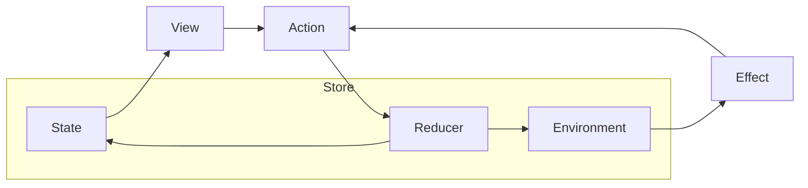

## TCA가 앱 개발에서 해결하고자 하는 것
- 상태(State) 관리: 간단한 값 타입들로 어플리케이션의 상태를 관리하는 방법, 상태를 공유를 통해 화면에서 일어나는 변화(Mutation)를 다른 화면에서 즉시 관측(Observe)하는 방법을 제공.
- 합성(Composition): 기능을 여러 개의 독립된 모듈로 추출하는 방법, 이 모듈을 다시 합쳐서 거대한 기능을 작은 컴포넌트의 집합으로 구성하는 방법을 제공.
- 사이드 이펙트(Side Effects): 어플리케이션 바깥세상과 접촉하는 작업을 테스트할 수 있고 이해하기 쉽게 작성하는 방법을 제공.
- 테스팅(Testing): 아키텍처 내부의 기능을 테스트하는 방법뿐만 아니라 여러 파트로 구성된 기능의 통합 테스트를 작성하는 방법, 사이드 이펙트가 어플리케이션에 끼치는 영향에 대해 전체 테스트를 작성하는 방법을 제공합. 이 테스트 방식은 여러분의 비즈니스 로직이 예상대로 잘 작동하는지에 대한 강한 보증도 제공.
- 인체 공학(Ergonomics): 위의 내용을 가능한 한 적은 개념의 간단한 API로 이루는 방법을 제공.

## TCA의 도메인
- `상태(State)`: 비즈니스 로직을 수행하거나 UI를 그릴 때 필요한 데이터에 대한 설명을 나타내는 타입.
- `행동(Action)`: 사용자가 하는 행동이나 노티피케이션 등 어플리케이션에서 생길 수 있는 모든 행동을 나타내는 타입.
- `환경(Environment)`: API 클라이언트나 애널리틱스 클라이언트와 같이 어플리케이션이 필요로 하는 `의존성(Dependency)`을 가지고 있는 타입.
- `리듀서(Reducer)`: 어떤 `행동(Action)`이 주어졌을 때 지금 `상태(State)`를 다음 상태로 변화시키는 방법을 가지고 있는 함수. 또한 `리듀서`는 실행할 수 있는 `이펙트(Effect, 예시: API 리퀘스트)`를 반환해야 하며, 보통은 `Effect 값`을 반환.
- `스토어(Store)`: 실제로 기능이 작동하는 공간. 우리는 `사용자 행동(Action)`을 보내서 `스토어(Store)`는 `리듀서(Reducer)`와 `이펙트(Effect)`를 실행할 수 있고, `스토어(Store)`에서 일어나는 `상태(State)` 변화를 관측(observe)해서 UI를 업데이트할 수도 있음.



## 간단한 예시
화면에 숫지를 증가시키는 `+버튼`, 감소시키는 `-버튼`, 탭하면 API호출을 해서 숫자에 관한 무작위한 사실을 `알림창으로 보여주는 버튼`이 있는 예시.

### 상태(State)
화면의 숫자(`count`)를 `Int`로 가지고 있을 것이고, 알림창을 보여줄 때 필요한 숫자에 관한 사실도 있을 것.
```swift
struct AppState: Equatable {
  var count = 0
  var numberFactAlert: String?
}
```

### 행동(Action)
증가 버튼이나 감소 버튼을 누르는 행동과 같이 명확한 행동.
알림창을 닫거나, 무작위 사실 API 리퀘스트 결과를 받았을 때 발생하는 행동 등.
```swift
enum AppAction: Equatable {
  case factAlertDismissed
  case decrementButtonTapped
  case incrementButtonTapped
  case numberFactButtonTapped
  case numberFactResponse(Result<String, ApiError>)
}

struct ApiError: Error, Equatable {}
```

### 환경(Environment)
화면이 제대로 작동하기 위해 필요한 `의존성(Dependency)을 관리`하는 `환경(Environment)`.  
숫자에 관한 사실을 가져오는 경우 네트워크 리퀘스트를 요약해서 `Effect` 값으로 만드는 작업이 해당됨.  
이 작업의 의존성은 `Int를 받아서 Effect<String, ApiError>를 반환하는 함수`.  
여기서 `String`은 `리퀘스트의 리스폰스를 요약한 값`. `Effect`는 통상적으로 백그라운드 스레드에서 작업을 처리하게 될 것. 예시에서는 `Effect`의 값을 메인 큐에서 받을 방법이 필요하기 때문에 메인 큐 스케줄러를 사용해야 테스트를 작성할 수 있음. AnyScheduler를 사용해서 프로덕션에선 DispatchQueue를 사용하고 테스트 시엔 테스트 스케줄러를 사용.

```swift
struct AppEnvironment {
  var mainQueue: AnySchedulerOf<DispatchQueue>
  var numberFact: (Int) -> Effect<String, ApiError>
}
```

### 리듀서(Reducer)
현재 `상태(State)`를 변화시켜서 다음 상태로 만드는 방법에 대한 설명과 어떤 `이펙트(Effect)`가 실행돼야하는지에 대한 설명이 필요. 만약 어떠한 `이펙트`도 실행이 필요하지 않은 경우엔 `.none`을 반환.
```swift
let appReducer = Reducer<AppState, AppAction, AppEnvironment> { state, action, environment in
  switch action {
  case .factAlertDismissed:
    state.numberFactAlert = nil
    return .none

  case .decrementButtonTapped:
    state.count -= 1
    return .none

  case .incrementButtonTapped:
    state.count += 1
    return .none

  case .numberFactButtonTapped:
    return environment.numberFact(state.count)
      .receive(on: environment.mainQueue)
      .catchToEffect()
      .map(AppAction.numberFactResponse)

  case let .numberFactResponse(.success(fact)):
    state.numberFactAlert = fact
    return .none

  case .numberFactResponse(.failure):
    state.numberFactAlert = "Could not load a number fact :("
    return .none
  }
}
```

### View의 정의(SwiftUI, UIKit)
`Store<AppState, AppAction>`가 있으면 모든 상태 변화를 관측하고 UI를 다시 그릴 수 있으며, 사용자 행동을 보내서 상태를 변화할 수도 있음. `.alert` View Modifier가 요구하는 대로 숫자에 관한 사실을 구조체로 한 번 감싸서 `Identifiable`을 따르게 만듦.
```swift
// SwiftUI version
struct AppView: View {
  let store: Store<AppState, AppAction>

  var body: some View {
    WithViewStore(self.store) { viewStore in
      VStack {
        HStack {
          Button("−") { viewStore.send(.decrementButtonTapped) }
          Text("\(viewStore.count)")
          Button("+") { viewStore.send(.incrementButtonTapped) }
        }

        Button("Number fact") { viewStore.send(.numberFactButtonTapped) }
      }
      .alert(
        item: viewStore.binding(
          get: { $0.numberFactAlert.map(FactAlert.init(title:)) },
          send: .factAlertDismissed
        ),
        content: { Alert(title: Text($0.title)) }
      )
    }
  }
}

struct FactAlert: Identifiable {
  var title: String
  var id: String { self.title }
}
```
중요한 사실은 이 모든 기능을 실제 `이펙트` 없이 구현할 수 있다는 것. 이는 기능 자체를 독립된 환경에서 디펜던시 없이 만들 수 있다는 것을 증명하는 것이며 컴파일 시간 단축으로 직결.  
이 말인즉슨, 동일한 `스토어`에 UIKit을 붙이는 것도 가능하다는 의미입. UI 업데이트나 알림창을 보여주는 작업을 위해 viewDidLoad에서 `스토어`로 구독(Subscribe)하면 됨.
```swift
// UIKit version
class AppViewController: UIViewController {
  let viewStore: ViewStore<AppState, AppAction>
  var cancellables: Set<AnyCancellable> = []

  init(store: Store<AppState, AppAction>) {
    self.viewStore = ViewStore(store)
    super.init(nibName: nil, bundle: nil)
  }

  required init?(coder: NSCoder) {
    fatalError("init(coder:) has not been implemented")
  }

  override func viewDidLoad() {
    super.viewDidLoad()

    let countLabel = UILabel()
    let incrementButton = UIButton()
    let decrementButton = UIButton()
    let factButton = UIButton()

    // addSubview나 constraint 설정하는 코드는 생략했습니다

    self.viewStore.publisher
      .map { "\($0.count)" }
      .assign(to: \.text, on: countLabel)
      .store(in: &self.cancellables)

    self.viewStore.publisher.numberFactAlert
      .sink { [weak self] numberFactAlert in
        let alertController = UIAlertController(
          title: numberFactAlert, message: nil, preferredStyle: .alert
        )
        alertController.addAction(
          UIAlertAction(
            title: "Ok",
            style: .default,
            handler: { _ in self?.viewStore.send(.factAlertDismissed) }
          )
        )
        self?.present(alertController, animated: true, completion: nil)
      }
      .store(in: &self.cancellables)
  }

  @objc private func incrementButtonTapped() {
    self.viewStore.send(.incrementButtonTapped)
  }
  @objc private func decrementButtonTapped() {
    self.viewStore.send(.decrementButtonTapped)
  }
  @objc private func factButtonTapped() {
    self.viewStore.send(.numberFactButtonTapped)
  }
}
```

### 스토어(Store)
스토어에서 의존성을 제공. 그리고 API 리퀘스트를 생략하기 위해 문자열을 mock 해서 바로 반환하는 `이펙트`를 주입.
```swift
let appView = AppView(
  store: Store(
    initialState: AppState(),
    reducer: appReducer,
    environment: AppEnvironment(
      mainQueue: DispatchQueue.main.eraseToAnyScheduler(),
      numberFact: { number in Effect(value: "\(number) is a good number Brent") }
    )
  )
)
```

