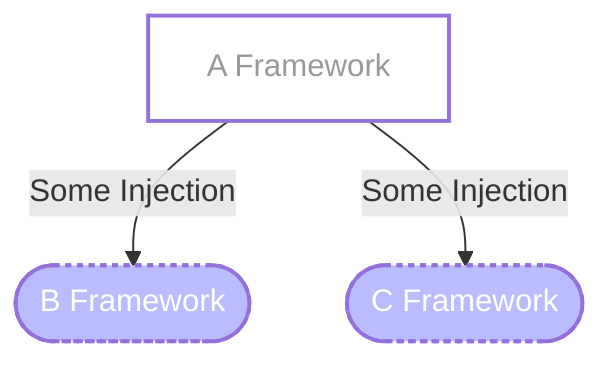
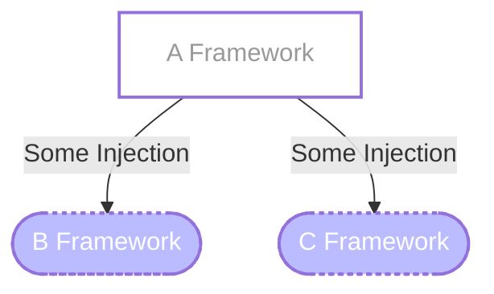
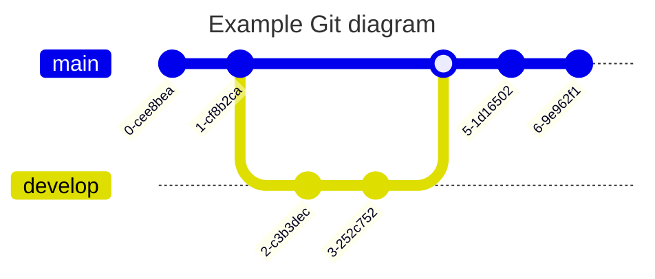

[http://mermaid.js.org](http://mermaid.js.org/)

최근에 다이어그램을 그릴 일이 있어서 자주 접하게 된 `Mermaid.js`라는 도구를 정리해봅니다.

`Mermaid`는 다이어그램, 차트 등을 마크다운으로 그리기 쉽게 해주는 라이브러리입니다.

`Flow Chart`, `Sequence Diagram`, `Class Diagram`, `State Diagram`, `ER(Entity Relationship)Diagram`, `User Journey`, `Gantt`, `Pie Chart`, `Quadrant Chart`, `GitGraph Diagram`, `MindMap`, `TimeLine`등 **굉장히 다양한 다이어그램 및 차트를 지원**합니다.

차트 모양을 바로 확인하면서 작성할 수 있는 **Live Editor**도 지원합니다.  
[https://mermaid.live/](https://mermaid.live/)  
  

### Basic

`Flow Chart`의 간단한 예시로는 아래처럼 표현할 수 있습니다.

```
flowchart TD
    A --> B
    A --> C
```

~~~mermaid
flowchart TD
	A --> B
	A --> C
~~~

조금 더 살을 붙여서,  
A는 \[네모]로, B와 C는 (\[둥근네모])로 수정하고 화살표에 텍스트를 추가한 모습입니다.  
A처럼 **한번 윗줄에서 정의한 것은 아랫줄부터 생략이 가능**합니다.

```
flowchart TD
    A[A Framework] -->|Some Injection| B([B Framework])
    A -->|Some Injection| C([C Framework])
```


### classDef

반복되는 형태는 **classDef**로 정의해서 사용할 수도 있습니다.

```
flowchart TD
    A[A Framework]:::dynamic -->|Some Injection| B([B Framework]):::static
    A -->|Some Injection| C([C Framework]):::static

    classDef dynamic fill:#fff,stroke:#ff,stroke-width:2px,color:#999
    classDef static fill:#bbf,stroke:#ff,stroke-width:2px,color:#fff,stroke-dasharray: 3 3
```




### click

클릭을 했을 때 다른 문서(url)로 이동하게 하거나,

```
flowchart TD
    A[A Framework]:::dynamic -->|Some Injection| B([B Framework]):::static
    A -->|Some Injection| C([C Framework]):::static

    classDef dynamic fill:#fff,stroke:#ff,stroke-width:2px,color:#999
    classDef static fill:#bbf,stroke:#ff,stroke-width:2px,color:#fff,stroke-dasharray: 3 3

    click A "https://www.naver.com" _blank
```



### FontAwesome

FontAwesome(fa)를 지원하여 아이콘을 넣을 수도 있습니다(노션 내 Mermaid에서는 미지원).

```
flowchart TD
    A[fa:fa-ban A Framework]:::dynamic -->|Some Injection| B([fa:fa-spinner B Framework]):::static
    A -->|Some Injection| C([fa:fa-camera-retro C Framework]):::static

    classDef dynamic fill:#fff,stroke:#ff,stroke-width:2px,color:#999
    classDef static fill:#bbf,stroke:#ff,stroke-width:2px,color:#fff,stroke-dasharray: 3 3

    click A "https://www.naver.com" _blank
```


---

### 그 외에 (언젠가 쓸거 같은) 그래프 및 차트 예제

#### SequenceDiagram

```
sequenceDiagram
    Alice->>John: Hello John, how are you?
    John-->>Alice: Great!
    Alice-)John: See you later!
```


#### GitGraph

```
---
title: Example Git diagram
---
gitGraph
   commit
   commit
   branch develop
   checkout develop
   commit
   commit
   checkout main
   merge develop
   commit
   commit
```



#### PieChart

```
pie title Pets adopted by volunteers
    "Dogs" : 386
    "Cats" : 85
    "Rats" : 15
```


#### MindMap

```
mindmap
  root((mindmap))
    Origins
      Long history
      ::icon(fa fa-book)
      Popularisation
        British popular psychology author Tony Buzan
    Research
      On effectiveness<br/>and features
      On Automatic creation
        Uses
            Creative techniques
            Strategic planning
            Argument mapping
    Tools
      Pen and paper
      Mermaid
```


#### TimeLine

```
timeline
    title History of Social Media Platform
    2002 : LinkedIn
    2004 : Facebook
         : Google
    2005 : Youtube
    2006 : Twitter
```


---

(그 외로)

**Notion**에서도 아래처럼 **Mermaid**블록을 지원합니다.

노션의 **Mermaid**블록에서는 코드보기, 미리보기, 분할보기(동기에보기) 옵션이 있어서 더 편리하게 실시간으로 보면서 그래프를 그리고 정리할 수 있습니다.

