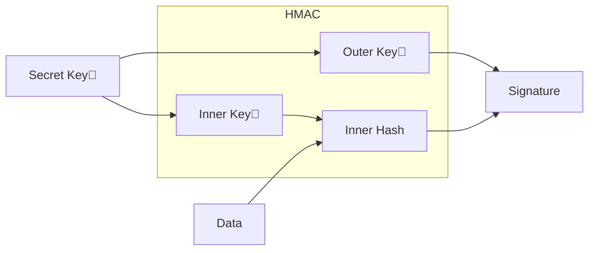
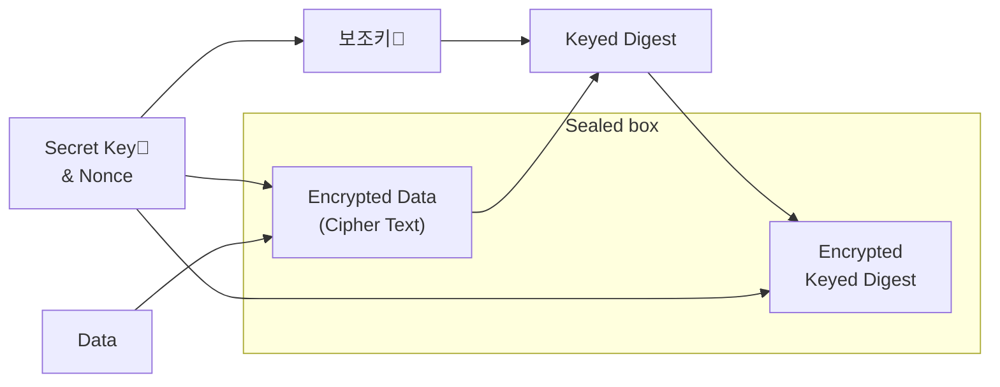

## Hasher와 Cryptographic Hashing

`Hashable 프로토콜 타입`의 객체를 `Hasher`로 hashing하면 무작위로 생성된 시드를 사용해서 해시값을 생성하여 실행될 때마다 다른 해시값을 생성시켜줍니다.

```swift
func hashItem(item: String) -> Int {
    var hasher = Hasher()
    item.hash(into: &hasher)
    return hasher.finalize()
}

// Hashing data
let hashValue = hashItem(item: "Hasher로 hash한 Data") // 실행시 마다 다른 해시값
```

`Cryptographic Hashing`은 `Hasher`와 같이 거의 유일한 해시값을 생성하고, 입력값을 조금만 변경해도 해시값이 크게 변합니다.

차이점은 매번 동일한 값을 생성시켜주며, `데이터 무결성을 안정적으로 검증할 수 있는 해시값`(= `Digest`, `Checksum`)을 생성하는 데 필요한 계산의 정도와 양이 다릅니다.

`Cryptographic Hashing` 알고리즘은 입력 데이터에 대해 작고 고정된 길이의 거의 유일한 데이터값(Digest)를 생성합니다. 가장 일반적인 `Digest`의 크기는 `256bit`, `512bit`입니다.

Hashing 알고리즘은 단방향이고, 비선형 연산을 포함하기 때문에 공격자가 역으로 `Digest`로부터 원래의 데이터를 연산할 수 없습니다. Output의 각 비트는 Input의 모든 비트에 의존하므로 공격자는 `Digest`의 일부에서 Input의 일부를 연산하려는 시도를 할 수 없습니다. Input에서 단 하나의 비트만 변경해도 완전히 다른 `Digest`가 생성되기 때문에 공격자는 Input, Output간의 관계를 찾을 수 없게 됩니다.

`Cryptographic Digest`는 거의 유일하고 되돌리기가 매우 어렵습니다.

위 같은 특성이 있는 `Digest`를 계산해서 두 데이터 집합이 다른지 확인할 수 있습니다.

예를 들어 Git에서는 모든 커밋을 식별하기 위해 `Digest`를 계산하고, 소프트웨어도 `Checksum`이라는 `Digest`를 제공해서 파일의 손상여부나 불완전성을 체크하기도 합니다.

`CryptoKit`은 `SHA-2(SecureHashAlgorithm-2)` 알고리즘인 `SHA-256`, `SHA-384`, `SHA-512`를 제공합니다. 각 숫자는 `Digest`의 크기. 기존 서비스와의 역호환을 위해 `Insecure` Container를 통해 `SHA-1(160bit)` 및 `MD5(128bit)`를 제공합니다.

아래는 resource로부터 `Data`를 가져오고, 가져온 `Data`로 `256bit Digest`를 생성하는 코드입니다.

```swift
func getData(for item: String, of type: String) -> Data {
    let filePath = Bundle.main.path(forResource: item, ofType: type)!
    return FileManager.default.contents(atPath: filePath)!
}

let data = getData(for: "HarryPotter", of: "png")
let digest = SHA256.hash(data: data)
```

위에서 만든 data를 네트워크로 다른 쪽으로 보내면, 받은 쪽에서는 아래처럼 같은 해시 알고리즘으로 `Digest`를 만들어 저장해 둔 `Digest`와 일치하는지 체크하면 됩니다.

```swift
let receivedDataDigest = SHA256.hash(data: data)
if digest == receivedDataDigest {
    print("보낸 data와 받은 data가 같음")
}
```

`Digest`는 `UInt64`의 튜플로 결과가 나옵니다.


`Digest`가 포함하는 String Description으로 표현하면 더 가독성있게 볼 수 있습니다.

```swift
String(describing: digest)
// SHA256 digest: 727c99a530674dc23ced09ebd6d5a4201c9a90b6a7119b61e8924a36ba4ccf7c
```

## Signing Digest

### HMAC(Hash-based Message Authentication)

악의적인 공격자는 변조시킨 데이터에 대해 올바른 `Digest`를 전송하기 때문에 데이터를 해시만 한다고 해서 악의적인 변조로부터 사용자를 보호할 수는 없습니다.

`Hash-based Message Authentication Code(HMAC, 해시기반 메시지 인증 코드)`는 `대칭 암호화 키(Symmetric Cryptographic Key)`로 `Digest`에 서명해서 악의적인 변조로부터 보호할 수 있습니다. 사용 예는 앱 서버에서 사용자가 파일을 업로드할 권한이 있는지 확인할 수 있도록 파일의 `Digest`에 서명하는 데에 쓰입니다.

`대칭키(Symmetric Key)`는 sender와 receiver 모두 알고 있는 비밀키. `HMAC`는 비밀키를 사용해서 `내부키(inner key)`와 `외부키(outer key)`를 만들어냅니다. 그리고 `data`와 `내부키`로 `내부해시`를 생성하고, `내부해시`와 `외부키`로 `서명(Signature)`를 생성합니다.



`CryptoKit`으로 `대칭키`를 만들 때는 아래 한줄을 작성하면 됩니다.

```swift
// 256bit 대칭키 생성
let key256 = SymmetricKey(size: .bits256)
```

`HMAC`를 공격하는 가장 일반적인 방법은 비밀키를 알아내기 위한 Brute Force 방식으로, `HMAC`의 보안은 비밀키의 크기에 따라 달라집니다. `CryptoKit`은 `.bits128`, `.bits192`, `.bits256` 세가지 크기를 지원합니다.

아래 코드는 위에서 생성한 `256bit 대칭키`를 이용해서 `data`에 대한 `512bit` `Signature`(혹은 `Authentication Code(인증 코드)`)를 생성하는 코드입니다.

```swift
let sha512MAC = HMAC<SHA512>.authenticationCode(for: data, using: key256)
String(describing: sha512MAC)
// HMAC with SHA512: 678481a3bda68dd9b99e13fb38216dadf5be0745ba00f334f613bb6bceaa9f05644810954a6176986fc04aee57dd447c510833935a46428e1ba7fe4fbfcf0060
```

서명한 값을 Data로 전환(authenticationCodeData)하여 네트워크로 전달하고,

```swift
// 네트워크로 전달하기 위해 서명을 Data로 convert
let authenticationCodeData = Data(sha512MAC)

// 네트워크로 서명을 전달
```

받은 쪽에서는 동일한 비밀키 `key256`을 가지고 있어 `HMAC<SHA512>`로 받은 `Data`가 올바른 값인지 인증할 수 있게 됩니다. 서명을 인증을 하고 나면 안심하고 데이터를 확인할 수 있습니다.

```swift
// 네트워크로 서명을 받음
if HMAC<SHA512>.isValidAuthenticationCode(authenticationCodeData,
                                          authenticating: data, using: key256) {
    print("MAC(메시지 인증 코드)가 데이터의 유효성을 체크: \(data))")
    UIImage(data: data)
}
else { print("유효하지 않음") }
```

`HMAC`를 사용하면 Sender의 신원과 데이터의 무결성을 체크할 수 있지만, Data를 암호화하지는 않습니다. TLS로 보낸 것이 아니라면 중간에서 데이터를 가로채서 확인할 수 있게 됩니다. 아래부터는 Data를 암호화하고 인증하는 방법입니다.

### Data Encrypting과 Authenticating

네트워크 데이터를 암호화하는 TLS로 보내더라도 사용자에게 암호화된 파일을 보내야 할 경우가 있습니다. 예를 들어 사용자가 인앱구매를 한 경우 encrypt된 파일과 그 파일을 decrypt하기 위한 키를 별도로 전송할 수 있습니다.

현재 가장 많이 사용하는 방식은 `AEAD(Authenticated Encryption with Associated Data, 연관 데이터로 인증된 암호화)` `Cipher(암호화 방식)`입니다. `AEAD Cipher`는 `Encryption`과 `MAC`에 서로 다른 키를 사용하고, `MAC`은 Plain Text가 아닌 `Cipher Text`를 해시합니다. 모든 것이 Sealed box에 결합됩니다.

일반적으로 사용되는 `AEAD`는 2가지입니다.

`AES-GCM(Advanced Encryption Standard Galois/Counter Mode)`와 `ChaCha20-Poly1305` 방식.

`AES-GCM`은 NIST에서 확립한 표준이며, `AES-GCM`이 뚫릴 경우를 대비해서 `ChaCha20-Poly1305`를 개발했습니다. 보통 모바일 기기에서는 `AES`방식이 느려서 상대적으로 빠른 `ChaCha20-Poly1306`가 많이 쓰지만, iOS에서는 `AES`하드웨어가 있기 때문에 `AES-GCM`을 자유롭게 쓸 수 있습니다.

`AES`와 `ChaCha20`은 `Cipher` 알고리즘이고, `GCM`과 `Poly1306`은 `MAC` 알고리즘입니다.

`Sealed box`를 생성하기 위해 `AEAD` `cipher`는 아래와 같은 입력값을 받습니다.

- 암호화 할 Plain Text
- 비밀키
- Unique한 초기값(IV 혹은 nonce): 동일한 Request를 여러번 보내는 것과 같은 replay 공격을 방지
- Optional: Authenticate되었지만 Encrypt되지 않은 non-secret Data. = `AEAD`에서 `AD(Associated Data)`

그리고 Sealed box를 생성.

1. `비밀키`와 `nonce`로 `보조키(secondary key)`를 생성
2. `비밀키`와 `nonce`로 `Encrypted Data(cipher text)`로 암호화(`cipher text`: Data를 동일한 길이의 Encrypted Data로 만든 것)
3. `보조키`를 사용해서 추가 데이터, `Encrypted Data` 및 각 `Data`의 길이에 대한 `Keyed Digest`(Key화된 Digest)를 생성
4. `비밀키`와 `nonce`를 사용해서 `Keyed Digest`를 Encrypt한 다음, `Encrpted Data`에 `Encrypted Keyed Digest`를 추가



그래프로는 조금 복잡해보일 수 있지만, 코드로는 간단하게 작성해서 `Sealed box` 생성이 가능합니다.

```swift
let sealedBoxData = try! ChaChaPoly.seal(data, using: key256).combined // (48285bytes)
```

`data`와 `비밀키`(key256)을 전달하고 `Sealed Box`를 얻습니다. `combined` 프로퍼티는 네트워크를 통해 전송할 수 있는 `Data`타입을 줍니다.

(`AES-GCM`을 사용하려면 `ChaChaPoly` 대신 `AES.CGM`으로 바꾸면 됩니다)

이제 이 `SealedBoxData`를 받은 곳에서는 다음과 같이 작성해서 `Sealed Box`로 전환합니다.

```swift
let sealedBox = try! ChaChaPoly.SealedBox(combined: sealedBoxData)
```

그리고 sender와 같은 비밀키를 가지고 있기 때문에 아래와 같이 작성해서 `Sealed Box`를 열고 decrypt할 수 있습니다.

```swift
let decryptedData = try! ChaChaPoly.open(sealedBox, using: key256) // (48257bytes)
```

보내기 전의 `sealedBoxData`가 실제데이터(이미지)보다 28bytes가 큰데,

`sealedBox`의 내용을 보면 `nonce`와 `tag`의 사이즈만큼이라는 것을 확인할 수 있습니다.

```swift
sealedBox.nonce  // (12 bytes)
sealedBox.tag  // (16 bytes)
```

두 알고리즘 모두 사용자를 위해 `nonce`를 선택하고 `open`을 사용할 수 있도록 `Sealed Box`에 넣을 수(pack) 있습니다.

16bytes의 `tag`는 `data`를 인증하는 서명인 `Encrypted Keyed Digest`입니다. `Sealed Box`를 만들 때마다 `nonce`가 변경되고, 그러면서 `Encrypted Keyed Digest`도 변경됩니다.

아래 코드를 통해서 암호화된 `data`를 볼 수 없다는 것을 확인할 수 있습니다.

```swift
let encryptedData = sealedBox.ciphertext
UIImage(data: encryptedData) // nil
UIImage(data: decryptedData) // UIImage
```