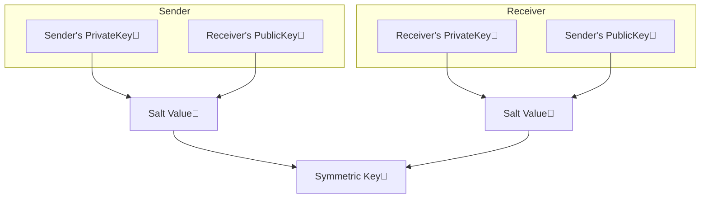

## Public-Key Cryptography

[이전 글](https://swiftycody.github.io/posts/CryptoKit-1-HMAC-AEAD/)에서 정리했던 `HMAC`, `Sealed Box`암호화는 Sender와 Receiver모두 키를 알고 있는 `대칭키`를 사용합니다.

`대칭키`는 대역 외(Out of band)로 전송되어야 하고, 이 작업을 안전하게 수행할 수 없는 경우 `공개키 암호화(public-key cryptography)`를 사용합니다. 실제로 인터넷에서 일상적으로 사용하는 대부분의 암호화는 `공개키 암호화`를 사용하고, Xcode가 앱에 서명을 할 때에도 동일합니다.

`공개키 암호화`는 수학적으로 연결된 두개의 키를 생성합니다. `개인키`는 비밀로 유지하고 해당 `공개키 Data`를 게시합니다. `개인키`로 `Data` 혹은 `Data Digest`에 `서명`한 다음 전송합니다. Receiver는 `공개키 Data`에서 `공개키`를 생성한 다음 이를 사용하여 `Signed Data` 혹은 `Digest`를 확인합니다.

예를 들어, 앱에서 백엔드 서버로 작업을 인증해야 할 수 있습니다. 사용자 디바이스에서 `개인키`를 생성해서 `Keychain` 혹은 `SecureEnclave`에 저장한 다음, 해당 `공개키`를 서버에 등록합니다. 사용자가 작업을 설정하면 앱이 사용자의 `개인키`로 작업 세부정보에 서명하고 서명된 세부정보를 서버로 전송하면 서버가 사용자의 `공개키`로 이를 확인합니다.

`Encrypted data`를 전송하려면 사용자와 Receiver가 각각 키 쌍을 생성하고 `공개키`를 게시합니다. 그리고 사용자, Receiver 모두 자신의 `개인키`와 상대방의 `공개키`를 결합해서 `shared secret`을 생성합니다. 양쪽 모두 이 `shared secret`을 사용하여 동일한 `대칭키`를 만들어낸 다음 위에서 설명했던 `AEAD`에 사용할 수 있습니다.

### 개인키, 공개키 생성하기

`공개키 암호화`의 주요 특징은 `Trapdoor 알고리즘`을 사용한다는 점입니다. `공개키`로부터 `개인키`를 계산해내는 것은 매우 어렵습니다.

1978년 `RSA(Rivest-Shamir-Adleman)`가 발표된 후 가장 널리 사용되는 공개키 알고리즘이 되었습니다. `RSA` 알고리즘은 매우매우 큰 수의 두 소인수 계수를 결정하는 어려움에 의존합니다. `RSA` 키 생성은 느리고 키 크기에 따라 시간이 늘어나는 단점이 있습니다.

1985년 처음 제안된 `ECC(Elliptic Curve Cryptography)`는 비슷한 수준의 보안을 위한 `RSA`의 키보다 훨씬 작은 키를 사용합니다. 256bit `ECC` 공개키 보안은 3072bit `RSA` 공개키와 비슷합니다.

|RSA key size|ECC key size|
|---|---|
|1024|160|
|2048|244|
|3072|256|
|7680|384|
|15368|512|

CryptoKit은 `ECC`알고리즘를 독점적으로 제공합니다. 알고리즘은 NIST의 `P256`, `P384`, `P521`와 Daniel J. Bernstein의 `Curve25519`을 제공합니다. `P256`이 가장 널리 사용되는 커브로 `prime256v1`으로 불리는 `OpenSSL`의 기본커브 입니다.

### Elliptic Curve Cryptography

타원곡선은 아래 방정식을 만족하는 점 (x, y)으로 구성됩니다.

$$ y^2 = x^3 + Ax + B $$

예를 들어, `y² = x³ - x + 1`은 아래와 같은 타원 곡선 그래프를 그립니다.


`ECC`는 타원곡선 중 아래 조건을 만족하는 `비특이 타원곡선`을 사용하는데

$$ 4a^3 + 27b^2 \ne 0 $$

`ECC`는 `비특이 타원곡선`의 아래와 같은 속성을 이용합니다.

- 그래프는 X축을 중심으로 대칭형
- 수직선이 아닌 모든 선이 그래프와 교차하는 지점은 3개 = 두 점 P와 Q를 연결하는 직선은 반드시 다른 한점과 연결됨

예를 들어 점`A`와 점`B`를 연결하는 선을 그립니다. 이 선이 그래프에서 만나는 또다른 점을 X축 대칭으로 반사된 점 `C` = `A•B` 를 얻을 수 있는데 이게 타원곡선에서 두 점에 대한 `점덧셈연산`하는 방법입니다.


점 `P`를 2번 연산(`P•P`)한 경우(= `2•P`) 접선(Tangent)과 그래프가 만나는 점을 X축 대칭으로 반사된 점을 구합니다. 이 방법으로 점`P`에 대한 `점곱셈연산`을 할 수 있습니다.


위에서 `2P`를 통해 구한 점에서 다시 접선을 이용해서 `4P`를, 다시 반복해서 `8P`를 구하는 방식으로 배가연산(Doubling)을 할 수 있습니다. `8P•P`를 하면 `9P`가 될 수 있습니다.

아래는 점`G`의 `2G`를 구하고, `2G`에서 다시 `4G`를 구하고 `4G`에서 `8G`를 구하는 예시입니다.


위와 같은 방식으로 점 `G`에 대한 `kG`(`k`는 양수)를 정의합니다. 이 속성을 사용하면 점 `G`에 대한 `k`번 점연산한 `kG`를 매우 빠르게 연산할 수 있습니다.

하지만 거꾸로 점 `G`와 `kG`의 정보만으로 `k`를 연산하는 것은 매우 어렵습니다.

실제 알고리즘은 소수 `n`을 `modulo`한 정수 값 `x`, `y`만 사용합니다. 시작점은 `Generator`라고 불러 보통 `G`라고 칭합니다.

`ECC`암호화시스템을 설정할 때, 곡선 방정직(계수 `x`와 상수 `b`), 이 곡선의 Generator점 `G`와 그에 해당하는 소수 `n`을 선택합니다. 그리고 무작위로 선택된 숫자 `k`가 `개인키`로 쓰이고, `kG`연산을 한 점이 `공개키`로 쓰입니다.

위 연산을 우리가 계산을 할 필요는 없고, `Curve25519`와 같은 표준곡선, NIST `ECC`에서 사용하는 곡선이 `CryptoKit`의 공개키 메서드로 이미 구현이 되어있습니다.

### 디지털 서명

`디지털 서명`은 `HMAC`과 유사하지만 `공개키 암호화`를 사용합니다. 같은 비밀키로 서명하고 확인하는 대신, Sender는 개인키를 사용해서 서명하고, Receiver는 Sender의 공개키를 사용해서 확인합니다.

(공개키 암호화: 개인키로 서명하고 공개키로 확인)

`디지털 서명`을 위한 알고리즘에는 2가지가 있습니다.

- NIST의 `P256`/`P384`/`P512`곡선을 사용하는 `ECDSA`(Elliptic Curve Digital Signature Algorithm, 타원곡선 디지털 서명 알고리즘)
- BernStein의 `Ed25519`곡선을 사용하는 `EdDSA`(Edwards-curve Digital Signature Algorithm, 에드워드 곡선 디지털 서명 알고리즘)

Sender가 Receiver에게 본인이 보낸 것을 알 수 있도록 `디지털 서명`을 하기 위해, `개인키`와 `공개키`를 먼저 만듭니다. `공개키`는 네트워크로 보내야 하기 때문에 `rawRepresentation`으로 `Data` 타입으로 만들어줍니다.

```swift
let senderSigningPrivateKey = Curve25519.Signing.PrivateKey()
let senderSigningPublicKeyData =
senderSigningPrivateKey.publicKey.rawRepresentation
```

그리고 Sender는 `개인키`로 Receiver에게 보낼 data에 서명을 합니다.

```swift
let signatureForData = try! senderSigningPrivateKey.signature(for: data)
```

혹은 data의 `Digest`에 서명을 합니다. data에 서명하는 것보다 빠릅니다.

```swift
let digest512 = SHA512.hash(data: data)
let signatureForDigest = try! senderSigningPrivateKey.signature(
    for: Data(digest512))
```

`Curve25519 개인키`를 사용할 때 `signature(for:)`는 해시 함수로 `SHA-512`를 사용해서 `Ed25519` 타원곡선 위에 data(혹은 Digest)의 `EdDSA 서명`을 생성합니다. 이 알고리즘은 무작위 `nonce`를 생성해서 동일한 data와 키에 대해서도 매 호출마다 다른 서명을 생성해서 타이밍 공격을 방지해줍니다.

`Curve25519` 대신 `P256`을 사용하는 경우, 해시 함수로 `SHA-256`을 사용해서 `P-256` 타원곡선 위에 data의 `ECDSA 서명`을 생성합니다.

이제 Sender는 Receiver에게 `data`, `digest512`와 `signatureForData`(혹은 `signatureForDigest`)를 보냅니다.

Receiver는 아래처럼 Sender가 생성한 `senderSigningPublicKeyData`로 키를 생성해서 서명을 확인할 수 있습니다.

```swift
let publicKey = try! Curve25519.Signing.PublicKey(
    rawRepresentation: senderSigningPublicKeyData)
if publicKey.isValidSignature(signatureForData, for: data) {
    print("Sender가 보낸 데이터가 맞음")
}
if publicKey.isValidSignature(signatureForDigest,
                              for: Data(digest512)) {
    print("보낸 데이터와 받은 데이터가 일치함")
    UIImage(data: data) // 데이터 사용
}
```

이제 data를 암호화하는 방법이 남았습니다.

### 암호화를 위한 대칭키(Symmetric Key) 생성

`Key agreement algorithm`을 사용하면 `공개키`와 `개인키`에서 `shared secret`을 생성한 다음, 합의된 `salt value`(소금값)을 추가해서 `대칭키`를 만들 수 있습니다.

`Public-Private key agreement algorithm` 다이어그램  


`Shared secret`의 생성은 간단합니다.

`G` = 타원곡선의 생성점, `s` = Sender의 `개인키` 라면

`s * G`가 Sender의 `공개키`입니다.

마찬가지로 Receiver의 `개인키`가 `r`일 때, `r * G`가 Receiver의 `공개키`가 됩니다.

Receiver는 Sender의 `공개키`에 자신의 `개인키`를 곱하고,

Sender는 Receiver의 `공개키`에 자신의 `개인키`를 곱해서 같은 점을 얻을 수 있습니다.

$$ (s * G) * r = (r * G) * s $$


이 방법이 `ECDH(Elliptic Curve Diffie Helman) key agreement`로,

NIST의 `P256`/`P384`/`P512` 곡선 혹은 Bernstein의 `X25519` 곡선 중 하나를 사용합니다.

이제 Sender와 Receiver는 `key agreement`를 위해 `개인키`와 `공개키`를 만들고 `공개키`를 data로 게시합니다.

```swift
let senderPrivateKey = Curve25519.KeyAgreement.PrivateKey()
let senderPublicKeyData = senderPrivateKey.publicKey.rawRepresentation

let receiverPrivateKey = Curve25519.KeyAgreement.PrivateKey()
let receiverPublicKeyData = receiverPrivateKey.publicKey.rawRepresentation
```

Sender와 Receiver는 대칭키를 만들기 위한 `salt value`에 agree(동의)해야 합니다.

이 `salt value`는 네트워크로 전송해도 상관없습니다. 공격자가 `개인키` 중 하나를 알고 있지 않는 한 공격자가 쓸 수 없습니다.

```swift
let protocolSalt = "둘이 약속한 소금값".data(using: .utf8)!
```

Sender는 Receiver의 공개키를 `raw representation`으로 생성하고, 이를 `개인키`와 결합해서 먼저 `sharedSecret`을 계산한 다음 `대칭키`를 계산합니다.

```swift
let receiverPublicKey = try! Curve25519.KeyAgreement.PublicKey(
    rawRepresentation: receiverPublicKeyData)
let senderSharedSecret = try! senderPrivateKey.sharedSecretFromKeyAgreement(
    with: receiverPublicKey)
let senderSymmetricKey = senderSharedSecret.hkdfDerivedSymmetricKey(
    using: SHA256.self, salt: protocolSalt,
    sharedInfo: Data(), outputByteCount: 32)
```

`Receiver`는 `raw representation`에서 Sender의 `공개키`를 생성하고, 이를 자신의 `개인키`와 결합해서 `sharedSecret`을 계산하고 `대칭키`를 계산합니다.

```swift
let senderPublicKey = try! Curve25519.KeyAgreement.PublicKey(
    rawRepresentation: senderPublicKeyData)
let receiverSharedSecret = try! receiverPrivateKey.sharedSecretFromKeyAgreement(
    with: senderPublicKey)
let receiverSymmetricKey = receiverSharedSecret.hkdfDerivedSymmetricKey(
    using: SHA256.self, salt: protocolSalt,
    sharedInfo: Data(), outputByteCount: 32)
```

두 대칭키가 일치하는지 확인해볼 수 있습니다.

```swift
if senderSymmetricKey == receiverSymmetricKey {
    print("Sender와 Receiver의 대칭키가 일치!")
}
```

이제 Sender와 Receiver는 동일한 대칭키를 생성할 수 있고, 이 대칭키로 `AEAD authenticated encryption`에 사용할 수 있게 됩니다.

(AEAD authenticated encryption하는 방법은 [이전글](https://swifty-cody.tistory.com/135) 참고)

## Secure Enclave의 P256 Key

추가적인 보호를 위해 `Secure Enclave`에서 직접 `P256 개인키`를 생성할 수 있습니다.

```swift
// Secure Enclave 사용한 디바이스인지 체크
if SecureEnclave.isAvailable {
    // Secure Enclave에서 P256 개인키 생성
    let privateKey = try SecureEnclave.P256.Signing.PrivateKey()
} else {
    let privateKey = P256.Signing.PrivateKey()
}
```

`Secure Enclave`에서 `개인키`를 사용하면 `공개키` 데이터를 생성하고 `data`, `Digest`에 서명하는 작업은 기존과 동일합니다.

```swift
// 개인키 data 생성
let publicKeyData = privateKey.publicKey.compactRepresentation!
// 서명 생성
let dataSignature = try privateKey.signature(for: data)
let digestSignature = try privateKey.signature(for: digest)
```

Secure Enclave에서는 Access Control을 통해 키 사용을 제한할 수 있습니다.

예를 들어 아래와 같이 작성하면 `Secure Enclave`에서 생성하는 키를 디바이스의 잠금이 해제된 경우에만 접근 할 수 있고, 해당 디바이스에서만 접근할 수 있도록 접근제한을 설정할 수 있습니다(`kSecAttrAccessibleWhenUnlockedThisDeviceOnly`). 그리고 `개인키`로 작업을 수행할 때 사용자의 존재를 요구하도록 하는데 이는 사용자가 TouchID, FaceID 혹은 디바이스 암호로 인증을 해야함을 의미합니다(`[.privateKeyUsage, .userPresence]`).

```swift
let accessControl = SecAccessControlCreateWithFlags(
    nil,
    kSecAttrAccessibleWhenUnlockedThisDeviceOnly,
    [.privateKeyUsage, .userPresence],
    nil)!
let privateKey = try SecureEnclave.P256.Signing.PrivateKey(
    accessControl: accessControl)
```