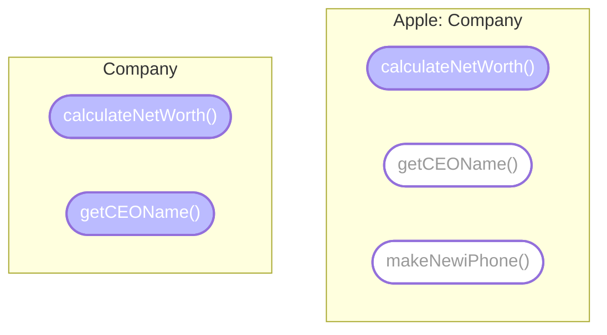

## 프로토콜 extension

프로토콜 자체를 확장하여 `프로토콜 member의 기본 구현을 제공`할 수 있습니다.

```swift
extension Localizable {
    static var supportedLanguages: [Language] {
        return [.english]
    }
}
```

여기서는 `supportedLanguages`의 기본 구현으로 `Localizable`을 확장합니다. `Localizable`을 준수하는 각 타입은 이제 해당 구현에 액세스할 수 있으므로 자체 정의할 필요가 없습니다.

```swift
struct Image: Localizable {
    // no need to add `supportedLanguages` here
}
```

위까지는 코드의 모든 유형이 구현할 수 있는 프로토콜로 작업했습니다.

특정 `class`에 의해서만 준수되도록 프로토콜을 제한할 수 있습니다. 각 `class`가 암시적으로 준수하는 프로토콜인 `AnyObject` 프로토콜을 상속하여 이를 수행합니다.

```swift
protocol UIKitLocalizable: AnyObject, Localizable {
    func change(to language: Language)
}
```

이 프로토콜에는 `MutableLocalizable`과 동일한 요구 사항이 있지만 `mutating` 키워드가 필요없어졌습니다. 이 프로토콜은 `class` 에 의해서만 구현될 수 있기 때문에 `mutating`을 지정할 이유가 없습니다. `class`에서는 모든 것이 기본적으로 이미 `mutable`합니다.

프로토콜 준수를 제한하는 것에 대해 말하면 프로토콜을 특정 `class`의 하위 `class`로만 제한할 수도 있습니다.

```swift
protocol LocalizableViewController where Self: UIViewController
{
    func showLocalizedAlert(text: String)
}
```

여기에서 프로토콜은 `UIViewController` 또는 그 하위 `class`에서만 사용할 수 있습니다.  
프로토콜은 추상적입니다. 하지만 그렇다고 해서 정확히 필요한 타입으로 적합성을 제한하는 데 필요한 만큼 구체적일 수 없다는 의미는 아닙니다.

이제 많은 타입과 프로토콜이 있으므로 이를 최대한 활용할 수 있습니다. 예를 들어 모든 `MutableLocalizable` 타입에서 작동하는 단일 함수를 정의할 수 있습니다.

```swift
func localize(_ localizables: inout [MutableLocalizable],
              to language: Language) {
    for var localizable in localizables {
        localizable.change(to: language)
    }
}
```

모두 `MutableLocalizable`을 구현하는 한 모든 유형의 조합으로 채울 수 있는 `MutableLocalizable`의 배열을 사용합니다.

## Static and dynamic dispatch

함수를 저장하고 호출하는 두 가지 주요 메커니즘은 `static/dynamic dispatch`입니다. `static dispatch`는 매우 간단합니다. 함수가 절대 변경되지 않는다는 것을 확실히 알고 있을 때 발생합니다. `static dispatch`는 무엇보다도 `struct`에 선언된 전역 함수 및 메서드와 `final class`의 메서드에 사용됩니다.

이러한 경우 걱정할 함수의 overriding이 없으므로 컴파일러는 어떤 의미에서 함수의 주소를 하드코딩하고 함수가 참조될 때마다 해당 주소로 이동할 수 있습니다.

> 메서드 디스패치 외에도 Swift가 광범위하게 사용하는 `inlining`라는 기술도 있습니다. `inlining`은 컴파일 시간에 함수 호출을 해당 함수의 전체 본문으로 대체합니다. 이는 함수를 호출하는 가장 빠른 방법이지만 `static dispatch` 및 특정 조건에서만 사용할 수 있습니다.
{: .prompt-tip }

상속과 프로토콜을 추가하면 상황이 좀 더 복잡해집니다. `final`이 아닌 `class` 인스턴스에서 호출된 메서드는 가능한 여러 위치에서 선언될 수 있습니다. `class`, 부모 `class`, `extention` 또는 `프로토콜 extension` 내에서 선언할 수 있습니다. 이는 컴파일러가 함수의 정확한 주소가 무엇인지 미리 알 수 없음을 의미합니다. 대신 `witness table`(감시 테이블)(`v-table` 또는 `가상 테이블`이라고도 함)이라는 것을 사용합니다.



컴파일러가 코드를 검토하면서 각 클래스에 대한 `table`을 생성합니다. 이 `table`에는 두 개의 열이 있습니다. 하나는 테이블의 `offset`에 대한 것이고 다른 하나는 해당 `offset`의 기능에 대한 것입니다. `class`의 각 함수는 작업 메모리에 저장된`table`에 저장됩니다. 하위 `class`는 부모 `table`의 복사본을 가져온 다음 재정의하려는 메서드의 행을 대체합니다. `witness table`이 구축되었으므로 Swift는 런타임에 `table`을 사용할 수 있습니다. 메서드 호출이 발생하면 Swift는 해당 메서드에 해당하는 `table`의 `offset`을 알고 있습니다.  
이를 통해 동일한 이름을 가진 메서드 구현을 동적으로 변경할 수 있으므로 상속, 다형성 및 프로토콜과 같은 기능을 사용할 수 있습니다. 그러나 이러한 기능에는 비용이 듭니다. 테이블 행에서 함수를 호출하면 각 함수 호출에 대해 일정한 오버헤드가 추가됩니다.

또한 `inlining` 및 기타 컴파일러 최적화를 방지하여 `static dispatch`보다 `dynamic dispatch`를 느리게 만듭니다.

# 프로토콜 in dispatch

상속이 `dynamic dispatch`를 요구하여 컴파일러의 수명을 복잡하게 만듭니다. 프로토콜도 상속을 지원합니다. 그 외에도 여러 클래스와 구조체가 동일한 프로토콜을 준수하고 동일한 메서드를 구현할 수 있습니다.

인스턴스 유형으로 프로토콜을 사용하는 경우 Swift는 `Localizable` 인스턴스가 `UILabel`인지 `Text`인지 미리 알 수 없습니다. 따라서 메서드를 `dynamic dispatch`해야 합니다.

  
프로토콜 메서드를 전달하는 것은 `class`가 작동하는 방식과 유사합니다. 프로토콜을 구현하는 모든 타입은 자체 프로토콜 `witness table`을 갖습니다. `table`에는 다시 두 개의 열이 있습니다. 하나는 함수가 있고 다른 하나는 해당 함수의 `offset`이 있습니다.  
프로토콜의 각 member(프로토콜 요구 사항으로 선언된 메서드 및 변수)에는 `table`에 자체 행이 있습니다. 그런 다음 이 `table`은 프로토콜을 구현하는 각 인스턴스와 함께 저장됩니다. 그런 다음 Swift는 런타임 시 `프로토콜 witness table`에서 올바른 함수를 찾아 호출할 수 있습니다. `class` 인스턴스를 사용하는 경우 Swift는 `class`와 `프로토콜 witness table` 모두에서 함수를 조회하여 올바른 구현을 동적으로 찾을 수 있습니다.

### 프로토콜 Extensions 다루기

```swift
protocol Greetable {
    func greet() -> String
}

extension Greetable {
    func greet() -> String {
        return "Hello"
    }
}
```

프로토콜을 구현하는 struct 작성

```swift
struct GermanGreeter: Greetable {

}
```

새 struct의 인스턴스를 만들고 프로토콜 메서드를 호출

```swift
let greeter = GermanGreeter()
print(greeter.greet())
```

`GermanGreeter`는 자체적인 `welcome` 메서드를 구현하지 않기 때문에 위의 줄은 `Hello`를 출력.

```
// 출력
Hello
```

이것이 작동하는 방식은 기본 인사말 구현이 프로토콜을 준수하는 모든 유형에 복사되고 `프로토콜 witness table`에 추가되는 것입니다. 프로토콜 자체에는 `table`이 없고 `Concrete(구체적인) 타입`에만 존재.

`GermanGreeter` 내부에 메서드를 구현하여 독일어로 번역하도록 작성.

```swift
struct GermanGreeter: Greetable {
    func greet() -> String {
        return "Hallo"
    }
}
```

```
// 출력
Hallo
```

이는 새 구현이 `프로토콜 witness table`의 extension 메서드를 대체했기 때문에 발생합니다. class에서 메서드를 override할 때도 마찬가지.

프로토콜 extension에 새 메서드를 추가합니다.

```swift
extension Greetable {
    func greet() -> String {
        return "Hello"
    }

    // 추가
    func leave() -> String {
        return "Bye"
    }
}
```

위 함수는 프로토콜 extension 안에 있지만 프로토콜의 `requirement`로 선언되지 않았습니다. 그러나 프로토콜을 구현하는 모든 타입은 여전히 메서드에 액세스할 수 있습니다. 새 메서드를 호출하여 이를 확인.

```swift
print(greeter.leave())
```

```
// 출력
Bye
```

`GermanGreeter`에 추가 코드 작성.

```swift
struct GermanGreeter: Greetable {
    func greet() -> String {
        return "Hallo"
    }

    // 추가
    func leave() -> String {
        return "Tschüss"
    }
}
```

```1c
// 출력
Tschüss
```

프로토콜을 사용하도록 `greetinger` 선언을 변경.

```swift
let greeter: Greetable = GermanGreeter()
```

💡 welcome은 여전히 Hallo를 출력하지만 이제 leave는 Bye가 출력.

```
// 출력
Hallo
Bye
```

Swift는 struct에서 선언한 함수를 완전히 우회하고 프로토콜 extension에서 함수를 호출하는 것으로 보입니다.

이런 동작의 원인으로는 호출된 함수가 변수의 선언된 타입에 따라 다르다는 것. 이것은 다형성이 작동하지 않는다는 것을 의미. 앞서 `dynamic dispatch`가 다형성을 가능하게 한다고 언급했으므로 `leave`는 `static dispatch`를 사용하여 호출해야 합니다.

실제로 extension 메서드는 전적으로 `static dispatch`에 의존합니다. `leave` 호출과 관련된 `table`은 없습니다. Swift는 변수 타입에서 정적으로 호출합니다. `welcome`은 프로토콜의 `requirement`에 추가하여 Swift가 메서드에 대한 `프로토콜 witness table` 항목을 생성하도록 강제하여 동적 `dispatch`를 활성화했기 때문에 예상대로 작동합니다.

프로토콜에 extension 메서드를 추가하는 것은 Swift에서 매우 일반적이기 때문에 이것은 중요합니다. struct와 class에 재사용 가능한 기능을 추가하는 좋은 방법. 그러나 extension 메서드를 재정의하려면 프로토콜 요구 사항으로 추가해야 한다는 점을 항상 염두에 두어야 하고 그렇지 않으면 매우 예상치 못한 결과가 발생할 수 있습니다.

## 프로토콜과 타입시스템

### Existentials

```swift
let greeter: Greetable = GermanGreeter()
```

위에서 작성한 `Greetable` 프로토콜을 변수로 사용한 코드.

변수로 `Greetable`을 사용하는 것과 `Int`와 같이 `Concrete 타입`을 사용하는 것에는 차이가 있습니다.

`Greetable`은 일반 타입처럼 보이고 작동할 수 있지만 `Existentials 타입`이라고 합니다. 이름이 화려하게 들리지만 개념이 그렇게 복잡하지는 않습니다. `Existentials 타입`을 실제 `Concrete 타입`에 대한 `placeholder`로 생각할 수 있습니다. 컴파일러는 이를 "이 프로토콜을 준수하는 타입이 존재합니다."라고 해석할 수 있습니다. `Existentials 타입`을 사용하면 프로토콜을 생각하지 않고 메서드 매개변수, 배열 요소, 변수 및 기타 데이터 구조 타입으로 사용할 수 있습니다.

### 프로토콜 타입으로 사용

예시.

```swift
func greet(with greeter: Greeter) -> Void
let englishGreeter: Greeter = EnglishGreeter()
let allGreeters: [Greeter] = [englishGreeter]
```

`& 연산자`를 사용하여 여러 타입을 단일 타입으로 구성할 수 있습니다.

```swift
func localizedGreet(with greeter: Greeter & Localizable) {

}
```

위의 `greeter` 매개변수는 `Greeter` 및 `Localizable`을 모두 준수하는 타입이어야 합니다. 프로토콜(Date & Codable)이 있는 struct 타입, 프로토콜이 있는 class 타입(UITableViewCell & Selectable) 또는 위와 같은 여러 프로토콜을 구성할 수 있습니다. Composition에서 원하는 만큼 많은 프로토콜을 함께 연결할 수도 있습니다.  
그러나 이러한 `Composited 타입`(`non-normal 타입`이라고도 함)은 변수 타입으로만 사용할 수 있습니다. 예를 들어 `Greeter` & `Localizable`에서 `extension`을 정의할 수 없습니다. 하지만 다른 방법으로 그렇게 할 수 있습니다.

예를 들어 프로토콜을 준수하는 `class`의 모든 하위 `class`의 `extension`을 정의할 수 있습니다.

```swift
extension UITableViewDelegate where Self: UIViewController {
    func showAlertForSelectedCell(at index: IndexPath) {
        // ...
    }
}
```

위에서 `UITableViewDelegate`를 준수하는 모든 `UIViewController`는 자동으로 `showAlertForSelectedCell` 구현을 가져옵니다.

제네릭 매개변수가 프로토콜을 준수하는 제네릭 타입을 extend하기 위해 drill down할 수도 있습니다.

```swift
extension Array where Element: Greetable {
    var allGreetings: String {
        self.map { $0.greet() }.joined()
    }
}
```

그리고 제네릭 매개변수가 프로토콜을 준수하는 제네릭 타입에 대한 프로토콜 준수를 추가할 수 있습니다.

```swift
extension Array: Localizable where Element: Localizable {
    static var supportedLanguages: [Language] {
        Element.supportedLanguages
    }
}
```

위의 `extension`은 `Element` 타입도 `Localizable`인 한 모든 배열을 `Localizable`하게 만듭니다. 이것은 Swift가 `Codable` 항목의 배열도 `Codable`을 준수하고 `Equatable` 항목의 배열이 `Equatable`을 준수하도록 만드는 방식입니다.

## Synthesized protocol conformance

(합성된 프로토콜의 적합성)

`Codable`과 같은 프로토콜을 따르자마자 마술처럼 작동하는 프로토콜이 있는데 이는 Swift가 합성된 프로토콜 구현을 생성할 때 발생합니다. Swift는 `Equatable`, `Hashable`, `Comparable` 및 두 가지 `Codable` 프로토콜인 `Encodable` 및 `Decodable`에 대해 이 작업을 수행합니다.  
프로토콜마다 이에 대한 제한이 있습니다. 일반적으로 Swift는 모든 프로퍼티가 해당 프로토콜을 conform하는 경우에만 프로토콜 conformance를 생성할 수 있습니다.

예를 들어 `Hashable`의 경우 Swift에서 필요한 메서드를 합성하려면 모든 프로퍼티가 `hashable`해야 합니다.

```swift
struct User: Hashable {
    let name: String
    let email: String
    let id: UUID
}
```